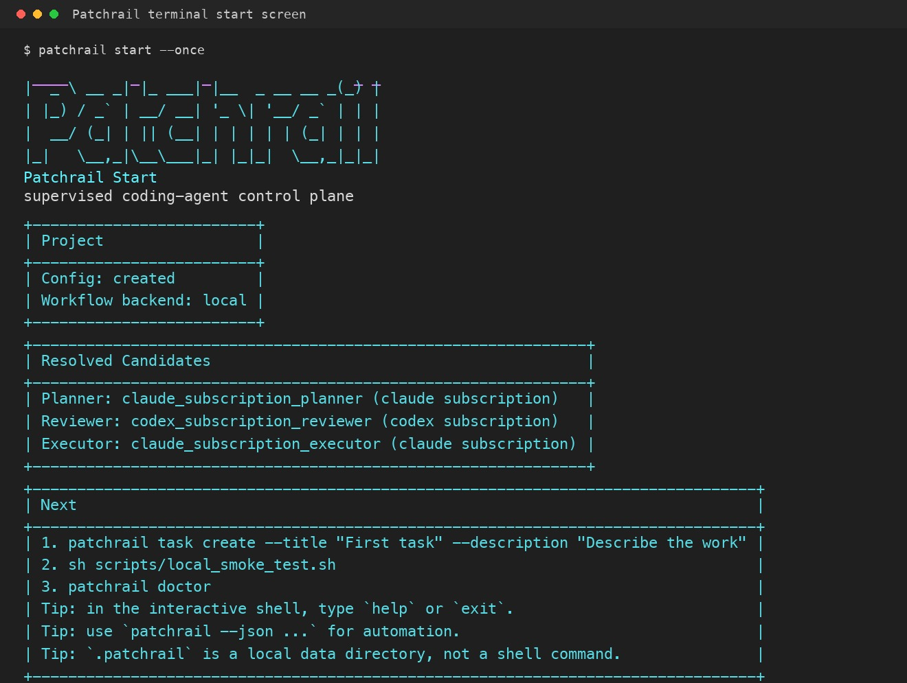

# Patchrail

Patchrail is a local-first verification and approval-packet CLI for AI coding agent work. It records supervised `task -> plan -> run -> verify -> review -> approval` workflows as local state, with planning briefs, runner contracts, evidence bundles, verification records, review queues, approval packets, decision traces, fallback approvals, and approval ledgers.



Terminal loading/start screen rendered by `patchrail start`. Patchrail is intentionally usable from a terminal before any hosted dashboard exists.

Patchrail keeps coding-agent supervision local instead of hiding planning, verification, review, approval, and artifacts behind a backend runtime. The CLI remains the canonical state engine. The next product direction is skill-first and CLI-backed, so Codex, Claude Code, Grok Build, or another compatible coding agent can follow a reusable Patchrail skill while the local CLI keeps durable records.

Japanese usage notes live in [README.ja.md](README.ja.md).

## What This Demonstrates

Patchrail is intended to be read as a serious engineering portfolio project, not only as a CLI prototype. It demonstrates:

- Product judgment: narrowing the problem from generic agent orchestration to verification and approval packets for AI-coded changes.
- Systems design: explicit lifecycle records, role separation, approval boundaries, local persistence, and resumable state.
- Practical CLI execution: commands that create tasks, capture Delivery Contracts, run executors, record verification, and export review-ready packets.
- Engineering discipline: focused tests, smoke tests, package metadata, release checks, and a local-first storage model that can be inspected from disk.

For interview-oriented material, see the [3-minute demo guide](docs/three-minute-demo.md) and [resume positioning notes](docs/resume-positioning.md).

## Development Purpose

Patchrail is being developed to make AI coding-agent work auditable before, during, and after implementation. Modern coding agents can move from a vague instruction to repository changes very quickly; the hard part is proving what the operator meant, what boundaries were agreed, what the executor actually did, what verification ran, and why a human approved the result.

The core purpose is to preserve that chain as local, inspectable records:

```text
human intent -> delivery contract -> plan snapshot -> runner execution -> verification evidence -> review -> approval packet
```

This is why Patchrail starts with a CLI and headless core rather than a dashboard. The first requirement is a reliable local record that can be checked, diffed, tested, packaged, and reviewed without trusting a remote service.

## Why This Is Necessary

AI coding workflows usually fail in the gaps between intention, execution, verification, and review:

- A chat transcript can describe intent, but it is not a durable operational record.
- A plan can look reasonable, but it becomes unsafe if it is disconnected from the assumptions and boundaries that produced it.
- A review can inspect the final diff, but it cannot reconstruct whether the executor stayed inside the original product, ontology, and approval boundaries.
- A passing test command is useful only if the command, cwd, output, exit code, and related run are recorded.
- A dashboard can make the workflow look organized, but it can also hide which system owns canonical state, evidence, and final approval.

Patchrail addresses those gaps by separating five current concerns:

1. Predict the desired future state before implementation.
2. Define the real-world ontology and approval boundaries before implementation.
3. Define post-implementation acceptance criteria before implementation.
4. Snapshot those inputs into a canonical plan before the runner executes.
5. Capture post-implementation verification and evidence before review and approval.

The result is not an autonomous-agent launcher and not an approval-button factory. It is a supervision rail: a local control plane that turns human judgment into scope, evidence, verification, review, and final outcome approval.

## What You Can Show In 3 Minutes

Patchrail demonstrates a practical safety boundary for AI coding work:

1. Create a task that describes the supervised work.
2. Attach future, ontology, and product briefs before implementation begins.
3. Validate the brief sequence and store a canonical plan that references those briefs.
4. Inspect the Runner Contract v1 handoff before execution.
5. Run an executor behind an explicit runner assignment.
6. Run operator-specified verification commands against the completed work.
7. Export a review-ready approval packet before any final approval.
8. Record the human approval decision and ledgers locally.

The point is not to make an agent autonomous by default. The point is to make the handoff between human intent, agent execution, review evidence, and final approval inspectable from disk.

For a public-facing walkthrough, see the [3-minute demo guide](docs/three-minute-demo.md) and [Supervised Agent Rollout](docs/case-studies/supervised-agent-rollout.md).

## Why Patchrail

- Keep the canonical workflow record in Patchrail rather than in a backend runtime.
- Let users bring the coding agent they already use by moving toward portable Agent Skills and future plugins.
- Preserve clear role separation across planner, reviewer, executor, and human approver.
- Constrain present implementation work with operator-defined completion, ontology, and scope documents rather than letting the next tool call decide the shape of the product.
- Make approval boundaries, fallback approvals, artifacts, verification results, packets, and decision traces inspectable from disk.
- Support optional workflow backends, including LangGraph, without handing over canonical state ownership.

## Current Release

`v0.2.0-alpha.1` consolidates the development work since `v0.1.0` around local contracts, verification evidence, and approval packets:

- Brief Schema v1: `future`, `ontology`, and `product` planning briefs carry `schema_version=patchrail.brief_schema.v1`; plan snapshots preserve the same schema marker.
- Runner Contract v1: shell-backed runners receive an explicit workspace and reserved environment boundary, inspectable through `patchrail contracts runner`.
- Evidence Bundle v1: run artifacts carry `schema_version=patchrail.evidence_bundle.v1`, manifest metadata, structured runner trace support, and collected runner-local artifacts.
- Verification records: `patchrail verify` stores command, cwd, exit code, elapsed time, stdout path, and stderr path for a run.
- Approval packets: `patchrail packet show|export` builds Markdown or JSON review packets from existing local records.
- Review queue: `patchrail list review-queue` groups tasks by verification and approval readiness.
- Skill scaffold: `skills/patchrail-supervise/SKILL.md` starts the portable Agent Skill path.

The current alpha also updates the smoke flow to create all three briefs, validate the sequence, execute the local harness, collect runner artifacts, record verification evidence, export an approval packet, and complete review plus human approval from local state.

## Next Direction

Patchrail is moving toward a skill-first, CLI-backed workflow. The next release line should reduce approval fatigue by defining policy once, letting low-risk work proceed inside that policy, and escalating boundary crossings instead of asking humans to approve every routine edit or local command.

The next direction is:

- `ApprovalProfile v1`: define `auto`, `ask`, and `deny` action classes for local coding-agent work.
- `RunLedger v1`: record the effective profile, auto-approved action classes, escalations, denials, receipts, and rollback notes.
- `patchrail-supervise`: harden the portable Agent Skill scaffold for Codex, Claude Code, Grok Build, and compatible agents while keeping the CLI as the durable local engine.
- Codex plugin packaging once the skill scaffold is validated.

Skill instructions are not the enforcement layer. Enforcement must come from host-agent permissions, sandbox settings, Patchrail policy records, hooks where available, and local evidence.

The direction is based on current coding-agent permission and human-in-the-loop feedback summarized in the [approval fatigue research note](reports/research/2026-06-26-approval-fatigue.md).

## Quickstart

From the repository root:

```bash
cd /path/to/Patchrail
brew install pipx
pipx ensurepath
sh scripts/install_cli.sh --python "$(command -v python3.13)"
patchrail --help
patchrail setup
```

To install the optional LangGraph runtime into the same `pipx` environment:

```bash
sh scripts/install_cli.sh --python "$(command -v python3.13)" --with-langgraph
```

Patchrail defaults to human-readable CLI output. Use `patchrail --json ...` for automation and scripting.

Deterministic local smoke:

```bash
patchrail setup
patchrail preflight --role planner
patchrail preflight --role reviewer
patchrail preflight --role executor --runner auto
sh scripts/local_smoke_test.sh
```

Manual verification and packet flow:

```bash
patchrail setup project --guided --title "First task" --description "Describe the supervised work"
# edit generated future/ontology/product files, then persist each edited brief
patchrail brief create --task-id <task_id> --kind future --file <future_brief_file>
patchrail brief create --task-id <task_id> --kind ontology --file <ontology_brief_file>
patchrail brief create --task-id <task_id> --kind product --file <product_brief_file>
patchrail brief validate --task-id <task_id>
patchrail plan --task-id <task_id> --auto
patchrail run --task-id <task_id> --runner auto
patchrail verify --run-id <run_id> --command "pytest -q"
patchrail list review-queue
patchrail packet show --task-id <task_id>
patchrail packet export --task-id <task_id> --output approval-packet.md
```

`patchrail start` opens the interactive shell in TTY sessions. Use `patchrail start --once` to render the home screen and exit immediately.

## Current Live Support

Auto generation:

- planner: `claude subscription`, `codex api`
- reviewer: `codex subscription`, `claude api`

Execution:

- `codex subscription`
- `claude subscription`
- `codex api`
- `claude api`
- `grok api`

`grok` is API-only in the default policy set. Patchrail does not currently ship a default `grok subscription` candidate.

## Local Storage

Patchrail persists state under `.patchrail/` or the directory pointed to by `PATCHRAIL_HOME`.

Useful read-side commands:

```bash
patchrail list tasks
patchrail brief list --task-id <task_id>
patchrail brief show --brief-id <brief_id>
patchrail contracts runner
patchrail list plans
patchrail list runs
patchrail list verifications
patchrail list review-queue
patchrail list reviews
patchrail list approvals
patchrail list fallback-requests
patchrail list preflight-snapshots
patchrail list artifact-bundles --has-trace
patchrail --json status --task-id <task_id>
```

## Docs

- [Architecture](docs/architecture.md)
- [Brief Schema v1](docs/contracts/brief-schema-v1.md)
- [Runner Contract v1](docs/contracts/runner-contract-v1.md)
- [Evidence Bundle v1](docs/contracts/evidence-bundle-v1.md)
- [Patchrail Supervise Skill](skills/patchrail-supervise/SKILL.md)
- [MVP](docs/mvp.md)
- [3-Minute Demo](docs/three-minute-demo.md)
- [Resume Positioning](docs/resume-positioning.md)
- [Local Testing](docs/local-testing.md)
- [Backlog](docs/backlog.md)
- [Approval Fatigue Research](reports/research/2026-06-26-approval-fatigue.md)
- [Changelog](CHANGELOG.md)
- [Agents Contract](AGENTS.md)
- [Japanese README](README.ja.md)

## License

MIT. See [LICENSE](LICENSE).
